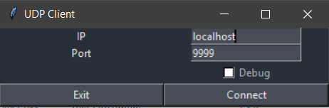
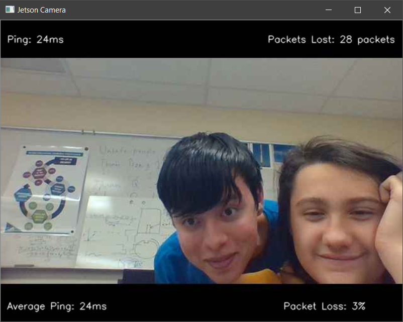

# UDP Client Camera Stream 2019

v1.5a

[](https://travis-ci.com/Osnott/tcp-udp-2019)

## Requirements

Please make sure you have python 3.6+ and pip both installed and in your system PATH.

## Dependencies

The only dependency for this code is opencv-python which is installed automaticly when you run the [build.bat](https://github.com/Osnott/tcp-udp-2019/blob/master/udp_client/build.bat) file (see [Building](#Building))

## Setup

Clone this repository. Make sure you have python 3.6+ installed and on your system PATH.

## Building

Almost all of the build steps are executed automatically. If there are any issues, please leave them in the **issues** tab.

The only thing that you need to do to generate the executable file is run this command:

```bash
./build.bat
```

or

```bash
build.bat
```

The [build.bat](https://github.com/Osnott/tcp-udp-2019/blob/master/udp_client/build.bat) file is located inside of the [udp_client](https://github.com/Osnott/tcp-udp-2019/tree/master/udp_client) folder.

## Usage

### Client

1. Run the compiled executable file (see [Building](#Building))
1. Input the ip of the server and port you want to connect to and click `Connect`
1. Wait for connection to go through
1. If you have connected, you should see a camera feed with minimal delay. If you do not see this, please double check the ip, port, and that you are connected to the wifi that the server is on. If all of these are true, please leave an issue in the issues tab.
1. To close the window, you must type `q` while the window is in the foreground.

### Testing Server

*Note: Test Server can be overwritten and you can use another server-like server. In addition, any issues with the test server will not be prioritized as the main part of this project is the client.*

To start the testing server, run the [server.py](https://github.com/Osnott/tcp-udp-2019/blob/master/Server/Server.py) file and add the arguments "*ip*" to the end of the python command.

### Making Your Own Server

Please refer to the [server.py](https://github.com/Osnott/tcp-udp-2019/blob/master/Server/Server.py) file to make your own server. Comments will be included soon.

## Screenshots


